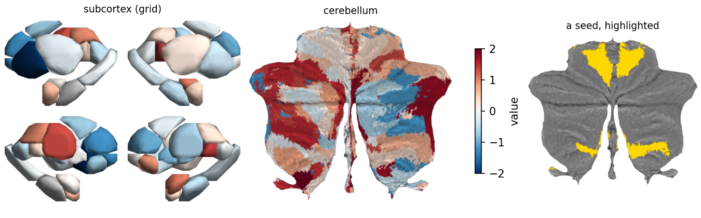

# scmaps

Subcortical and cerebellar brain maps in Python:

* the 32 ROIs of the **Tian S2** subcortical atlas (Melbourne Subcortex Atlas,
  Scale II), drawn as 3-D surfaces;
* the 32 regions of the **Nettekoven** asymmetric cerebellar atlas
  (NettekovenAsym32), drawn on **SUIT's flatmap**.

It is a port of MATLAB plotting code (`plotSubcortex.m`, and
`plotCerebellum.m` built on SUIT's `plotflatmap.m`). It uses the same surfaces,
views, scale, lighting and flatmap colour arithmetic, checked map by map
against the MATLAB renders. You don't need MATLAB, SPM or SUIT to run it; it
draws off-screen with VTK.



## Install

```bash
pip install git+https://github.com/alirzar/scmaps
```

Needs Python ≥ 3.10 and `numpy`, `matplotlib`, `nibabel` and `vtk`, which pip
installs for you.

## Use

```python
import numpy as np
import matplotlib.pyplot as plt
import scmaps

values = np.random.default_rng(0).normal(size=32)

# an RGBA image (H x W x 4 uint8, transparent background)
img = scmaps.subcortex_map(values, cmap="RdBu_r", vmin=-2, vmax=2, layout="grid")
img = scmaps.cerebellum_map(values, cmap="RdBu_r", vmin=-2, vmax=2)

# or drawn straight into matplotlib axes, with a ScalarMappable for the colourbar
fig, (a, b) = plt.subplots(1, 2)
sm = scmaps.plot_subcortex(values, ax=a, cmap="RdBu_r", vmin=-2, vmax=2)
scmaps.plot_cerebellum(values, ax=b, cmap="RdBu_r", vmin=-2, vmax=2)
fig.colorbar(sm, ax=[a, b])
```

**Values.** Pass 32 values in plotting order, or a mapping (a dict or a
pandas Series) from region name to value:

| | order | names |
|---|---|---|
| subcortex | left hemisphere's 16 ROIs, then the right's | `scmaps.SUBCORTEX_REGIONS`: `aHIP-lh`, `pHIP-lh`, … `pCAU-rh` |
| cerebellum | Nettekoven Asym32 labels 1–32 in the atlas's current numbering (1–16 left, 17–32 right) | `scmaps.CEREBELLUM_REGIONS`: `M1L` … `S5L`, `M1R` … `S5R` |

A region with NaN, or one missing from a mapping, has no value. It is drawn
grey on the subcortex (`nan_color`) and shows only the flatmap's grey underlay
on the cerebellum. Values outside `[vmin, vmax]` take the end colours. If you
leave out `vmin` / `vmax`, they default to the values' min and max.

**Cerebellar data in the atlas's original numbering.** Nettekoven atlas files
from before November 2023 number the regions differently: today's S5 was
named A4 and had label 8 (24 on the right), and D1–S4 had labels 9–16
(25–32). If your values were extracted with such a file, pass them by name
with `CEREBELLUM_REGIONS_ORIGINAL`:

```python
img = scmaps.cerebellum_map(dict(zip(scmaps.CEREBELLUM_REGIONS_ORIGINAL, values)))
```

**Colours instead of values.** Use `colors=`: one colour, 32 colours (`None`
for no value), or a mapping from name to colour. For example,
`scmaps.subcortex_map(colors={"aHIP-lh": "red"})`.

**Options**

| | subcortex | cerebellum |
|---|---|---|
| layout | `layout=`: `"grid"` (2 × 2), `"row"` (1 × 4), `"lateral"`, `"left"` | the flatmap |
| size | `dpi=` (default 300); each view is 1.2 in tall | `dpi=`; the canvas is 4 in square |
| highlight | `highlight=[names]`, `highlight_color=` (default gold) | the same, drawn without the underlay's shading (e.g. a seed) |
| other | `nan_color=` (default grey 0.82) | `alpha=` (default 0.75): how much underlay shading shows through, one value or one per region |

The renderers take RGB directly as well:
`scmaps.render_subcortex(rgb32x3, layout, dpi)` and
`scmaps.render_cerebellum(rgb32x3, alphas, dpi)`.

## How it matches MATLAB

* **Subcortex.** Uses the ROI surfaces of MATLAB's `boundary(..., 0.5)`. The
  views are tiled edge to edge at one scale and drawn with orthographic side
  views. The lighting is MATLAB's own, computed per vertex and interpolated
  across each triangle, as `lighting gouraud` does it:
  * vertex normals are the sum of the adjacent faces' unit normals;
  * back faces are lit with `'reverselit'`;
  * the light is a local `camlight` 30° right and 30° up of the camera;
  * the material is `dull` (0.3 ambient + 0.8 diffuse).

  These constants were measured on figures that MATLAB R2024b made.
* **Cerebellum.** `plotflatmap.m`'s arithmetic:
  * the underlay is shown through `gray(256)` on [-1, 0.5];
  * the overlay is blended as `colour × ((1 − α) + α × underlay)`;
  * colours are interpolated across each triangle.

Against the MATLAB renders of 60 maps, the silhouettes agree at
IoU ≥ 0.995 (subcortex) and ≥ 0.998 (cerebellum). The mean colour difference
is ≤ 0.008 and ≤ 0.004 on a 0–1 scale. `tests/test_render.py` checks this
against two stored MATLAB renders.

## Headless use

VTK renders off-screen, but it still needs an OpenGL implementation. On a
Linux server or in CI without a display, use VTK ≥ 9.4, which falls back to
EGL or OSMesa. Otherwise, install OSMesa (`libosmesa6`) or run under
`xvfb-run`.

## Development

```bash
pip install -e ".[test]"
pytest
```

`tools/convert_resources.py` regenerates the `.npz` atlas files in
`src/scmaps/data/` from their sources in `tools/source/`, and checks
that the conversion is lossless.

## Citing

If you use scmaps in a publication, please cite the atlases and tools it
draws. The Melbourne Subcortex Atlas licence requires the Tian et al. citation,
and the other sources ask for attribution. Full references are in `NOTICE`.

* **Subcortex:** Tian Y, Margulies DS, Breakspear M, Zalesky A (2020).
  Topographic organization of the human subcortex unveiled with functional
  connectivity gradients. *Nature Neuroscience* 23: 1421–1432.
* **Cerebellar parcellation:** Nettekoven C, et al. (2024). A hierarchical
  atlas of the human cerebellum for functional precision mapping. *Nature
  Communications* 15: 8376.
* **Flatmap:** Diedrichsen J, Zotow E (2015). Surface-based display of
  volume-averaged cerebellar imaging data. *PLoS ONE* 10(7): e0133402.
  Also Diedrichsen J (2006), *NeuroImage* 33(1): 127–138, for the SUIT
  template, and Wang Y, et al. (2026), *Imaging Neuroscience* 4,
  IMAG.a.1323, for SUITPy, the source of the flatmap files.

## Licence

The scmaps code is MIT (`LICENSE`). The bundled atlas data stays under the
terms of its sources (`NOTICE`):

| data | licence |
|---|---|
| SUIT flatmap and underlay | MIT with an acknowledgement clause, from SUITPy (`LICENSES/SUITPy.txt`) |
| Nettekoven cerebellar labels | CC BY (attribution) |
| Tian S2 subcortical surfaces | Melbourne Subcortex Atlas License: free use and distribution; publications must cite Tian et al. (2020) |
